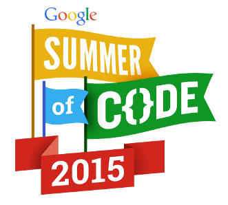

# Contributors

## Individuals

Current Developers

- Jachym Cepicky (@jachym)
  - Initial author, core developer, coordinator of development
  - PyWPS 1.x, 2.x, 3.x, 4.x
  - PSC member

- Luís de Sousa (@ldesousa)
  - Developer and coordinator of PyWPS-4 development
  - PyWPS 4.x
  - PSC member

- Calin Ciociu (@Noctalin)
  - Main developer of PyWPS-4, REST interface
  - PyWPS 4.x

- Tom Kralidis (@tomkralidis)
  - Web pages, OSGeo incubation
  - PSC member

- Jonas Eberle (@jonas-eberle)
  - PyWPS 3.x
  - PSC member

- Jorge de Jesus (@jorgejesus)
  - Core developer
  - PyWPS 1.x, 2.x, 3.x
  - PSC member

- You
  - Did we forget you?  Tell us!

Past Developers

- [Lorenzo Becchi](lorenzo at ominiverdi com) ([Homepage](http://omniverdi.org))
  - Initial author of GUI, ka-Map Developer
  - PyWPS 1.x, 2.x, 3.x

- [Luca Casagrande](luca.casagrande at gmail com) ([Homepage](http://omniverdi.org))
  - Initial author of GUI, ka-Map Developer
  - PyWPS 1.x, 2.x, 3.x

- [Sebastian Holler](sh at sholler de) ([Homepage](http://sholler.de))
  - Core developer
  - PyWPS 1.x, 2.x, 3.x

- [Panagiotis Skintzos](p at pskintzos net) ([Homepage](http://pskintzos.net))
  - Core developer
  - PyWPS 1.x, 2.x, 3.x

- [Alex Morega](alex at grep ro)
  - Architect of PyWPS-4
  - PyWPS 4.x

- You
  - Did we forget you? Tell us!

## Institutions

|  | [OpenGeoLabs.cz](http://opengeolabs.cz): Czech limited company, supporting PyWPS-4 and PyWPS-3.x core development since 2014. |
|  | [Public Research Centre Henri Tudor](http://www.list.lu): helped organize the first PyWPS workshop and meeting for all PyWPS developers in spring 2014. |
|  | [Google Summer of Code](https://www.google-melange.com/gsoc/homepage/google/gsoc2015): a student via GSOC contributed to PyWPS development in 2015. |
|  | [Help Service - Remote Sensing s.r.o.](http://www.bnhelp.cz) (2006 - 2010):  The financial support is possible thanks to the [Prezem](http://www.prezem.cz) project, which is supported by [Czech Ministry of Education, Youth and Sportshref](http://www.msmt.cz). |
|  | [Deutche Bundesstiftung Umwelt](http://www.dbu.de) (2006): thanks to stipendium programm for east European students. |
|  | [Intevation GmbH](http://www.intevation.de) (since 2006): server and project environment at <http://wald.intevation.org> |

