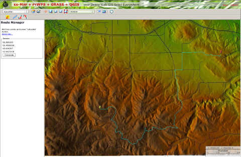

# Gallery

Some working examples of PyWPS in action.  Add yourself!

**PyWPS-4 used in OGC Soil Data IE Demonstration - Sydney, Australia - 03 December 2015**

URL: <https://www.youtube.com/watch?v=kNVfKVhtKJ8&t=38m>

**Height profile by Norwegian Mapping Authority**

- MapFish
- Matplotlib

URL:
  <http://norgeskart.no/adaptive2/default.aspx?gui=1&lang=2>
  <http://openwps.statkart.no/skwms1/wps.elevation?service=WPS&request=GetCapabilities>

Provided by:
  [Norwegian Mapping Authority / Statens kartverk](http://norgeskart.no)

**Ominiverdi's demo page**

- Integration to ka-Map!
- Buffer, Path, r.drain and other modules in usage
- [GRASS GIS](http://grass.osgeo.org)

URL: <http://pywps.ominiverdi.org>

Provided by: [Ominiverdi](http://ominiverdi.org)

**Analytical server of Czech Forest Management Institute**

- Supervised and unsupervised image classification
- Image postprocessing
- Get sample training areas from
- PyWPS and OpenLayers integration
- [GRASS GIS](http://grass.osgeo.org)
- Sample training areas file:  <http://apps.humboldt-esdi.cz/klasifikace/training_areas/training_areas_en.gml>

(note: works only on south-eastern part of Czech republic)

URL: <http://apps.esdi-humboldt.cz/klasifikace>

Provided by: [HS-RS](http://bnhelp.cz)

**Analytical server of Slovak Environmental Agency**

- Visibility analysis
- OpenLayers integration
- [GRASS GIS](http://grass.osgeo.org)

URL: <http://geo.sazp.sk>

Provided by: [HS-RS](http://bnhelp.cz)

**INSPIRE Transformation service**

- Demonstration implementation of INSPIRE Transformation service according to [INSPIRE Draft Transformation Implementing Rule (Version 2.0)](http://inspire.jrc.ec.europa.eu/reports/ImplementingRules/network/D3.10_Draft_IR_Transformation_Services_v2.0.pdf)
- Uses GML v2.0
- Integration with OpenLayers
- Full source at <http://dev.bnhelp.cz/inspire>
- [GDAL](http://www.gdal.org)

URL: <http://dev.bnhelp.cz/inspire/client>

Provided by: [HS-RS](http://bnhelp.cz)

**Google maps API integration**

- Google Maps http://maps.google.com
- OpenLayers http://openlayers.org
- GRASS GIS

URL: <http://pywps.ominiverdi.org/demo_google.html>

Provided by: [Ominiverdi](http://ominiverdi.org)

**Your Site**

Did we forget you? Tell us!
